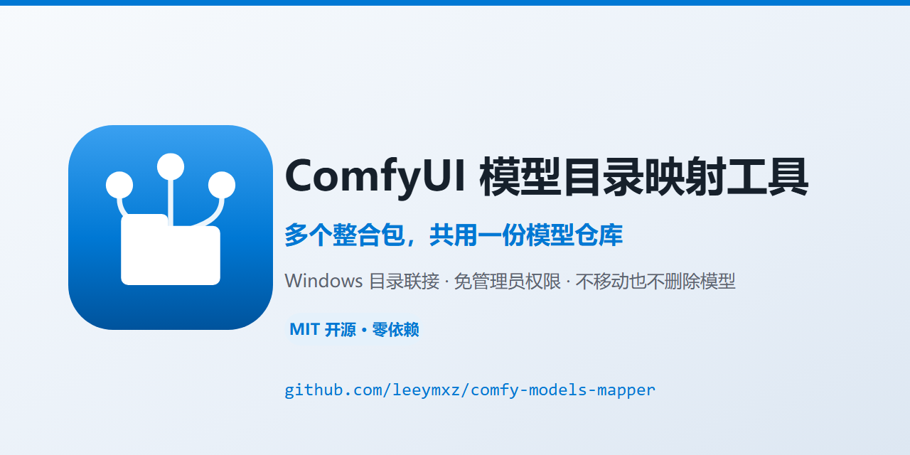
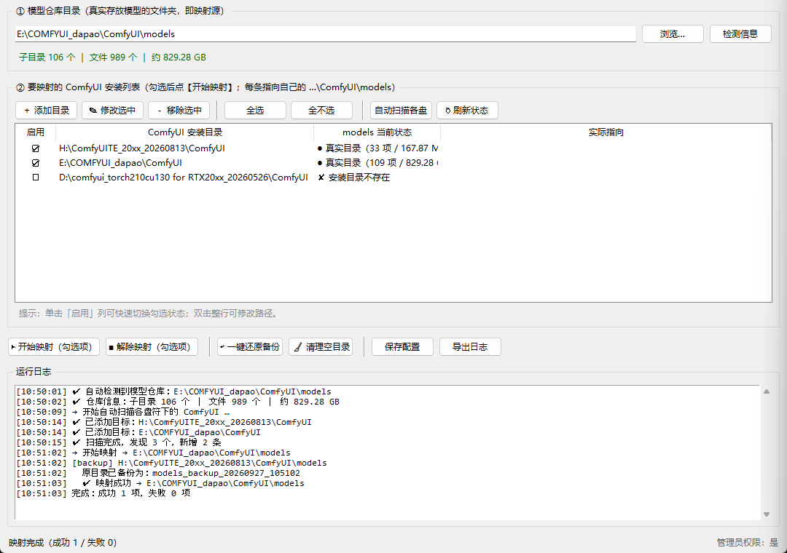

<div align="center">
  
</div>

# ComfyUI 模型目录映射工具

把多个 ComfyUI 整合包的 `models` 目录，统一映射到**一份真实的模型仓库**，
避免几百 GB 的模型被复制到每个整合包里重复占用硬盘。

底层用 Windows **目录联接（Junction）** 实现，等同于 `mklink /J`。
单文件 Python 程序，**零第三方依赖**，不联网、不改注册表、不碰你的模型文件。

> English: A GUI tool that lets several ComfyUI installations share **one** model
> repository via Windows Junctions (`mklink /J`), instead of duplicating hundreds
> of gigabytes. Single-file Python, no dependencies, no data is ever moved or deleted.



---

## 为什么需要它

装了多个 ComfyUI 整合包（不同 CUDA 版本、不同插件环境）时，
每个包都有独立的 `models` 目录。同一个 7 GB 的 checkpoint 想在各包里都能用，
就得复制好几份 —— 硬盘很快就没了。

用目录联接之后：

```
H:\ComfyUITE_20xx_20260813\ComfyUI\models  ─┐
F:\ComfyUITE_2080_20260920\ComfyUI\models  ─┼─▶  E:\COMFYUI_dapao\ComfyUI\models
（以及任意多个整合包）                      ─┘     （真实模型，只存一份）
```

对所有程序来说，`H:\...\models\checkpoints\sd_xl.safetensors` 就是一个真实存在的文件，
ComfyUI 不需要任何额外配置。

---

## 快速开始

1. 双击 **`启动工具.bat`**
2. 在「① 模型仓库目录」里选真实存放模型的文件夹，点【检测信息】确认大小
3. 在「② 要映射的 ComfyUI 安装列表」点【自动扫描各盘】，或手动【＋ 添加目录】
4. 勾选要生效的项 → 点【▶ 开始映射】
5. 确认操作清单 → 完成，**重启 ComfyUI 生效**

> 也可以直接跑源码：`python comfy_models_mapper.py`

### 双击没反应 / 闪退？

先双击 **`环境诊断.bat`**，它会打印 Python 位置、tkinter 是否可用、能否正常导入工具。

若仍然闪退，检查目录下是否生成了 **`崩溃日志.txt`**，里面有完整报错堆栈。

常见原因：没装 Python，或安装时**没勾选 tcl/tk**。

---

## 界面说明

| 区域 | 作用 |
|---|---|
| ① 模型仓库目录 | 映射的**源**。所有 ComfyUI 都指向它。选真实目录，不要选链接 |
| ② ComfyUI 安装列表 | 映射的**目标**。每条自动补全到 `…\ComfyUI` 层，实际操作的是其下的 `models` |
| 启用列 | 单击「启用」列即可勾选 / 取消 |
| models 当前状态 | `● 真实目录` / `✔ 已映射` / `— 不存在` / `✘ 安装目录不存在` |
| 实际指向 | 若已是链接，显示它当前指向哪里 |

| 按钮 | 说明 |
|---|---|
| ▶ 开始映射 | 对勾选项建立 Junction |
| ■ 解除映射 | 删除 models 链接本身（**不动**指向的真实文件） |
| ↩ 一键还原备份 | 把 `*_backup_*` / `*_linkbak_*` 改回 `models` |
| 🧹 清理空目录 | 扫描并删除「0 文件 0 字节」的遗留空目录 |
| 保存配置 / 导出日志 | 配置存本地 `mapper_config.json`，日志可导出 txt |

---

## 安全机制

这是本工具最核心的部分 —— **不会碰你的模型文件**：

1. **不移动、不复制、不删除模型数据** —— 全程只创建 / 删除链接本身
2. **目标非空 → 自动改名备份**，而不是删除
   `models` → `models_backup_20260927_105102`，原数据完整保留
3. **空目录才移除** —— 用 `os.rmdir`，非空会直接报错，天然安全阀
4. **删除链接用 `os.rmdir` 而非 `shutil.rmtree`** —— 物理上无法递归删到目标内容
5. **非链接拒绝删除** —— 任何情况下都不会误删真实目录
6. **映射失败自动回滚** —— 把备份改回原位，保持原状
7. **防自映射 / 防链式映射** —— 源与目标相同、或源本身是链接时会拦截并警告
8. **执行前弹出完整操作清单**，你确认了才动手

---

## 关于 mklink 参数

很多人第一反应是用 `/D`，本工具用的是 `/J`：

| | `/D` 符号链接 | `/J` 目录联接 ✅ |
|---|---|---|
| 管理员权限 | 通常**需要** | **不需要** |
| 跨盘（如 H 盘 → E 盘） | 支持 | 支持 |
| 对程序透明 | 是 | 是（更不易被误判） |
| 要求目标存在 | 否 | 建议存在 |

对「把某个 models 目录指向另一个盘的真实目录」这个场景，`/J` 更省事也更稳。
若 `/J` 因特殊权限失败，工具会自动用 PowerShell 的 `New-Item -ItemType Junction` 兜底。

---

## 环境要求

- Windows（Junction 是 NTFS 特性）
- Python 3.8+，且自带 `tkinter`
- **无第三方依赖**，无需 `pip install`

`启动工具.bat` 会依次尝试：`C:\Python314` → 用户目录 Python → `PATH` 里的 python。

---

## 目录结构

```
comfy-models-mapper/
├─ comfy_models_mapper.py   主程序（单文件，无依赖）
├─ 启动工具.bat              双击启动（GBK 编码，勿改编码）
├─ 环境诊断.bat              出问题时先跑这个
├─ screenshot.png           界面预览
├─ mapper_config.json       首次保存后生成的配置（已 gitignore）
└─ tests/
   ├─ _selftest.py          底层能力自测（10 项）
   ├─ _e2e.py               端到端演练（映射 → 解除 → 还原）
   ├─ _battest.py           验证 bat 能否拉起 GUI
   └─ _crashtest.py         验证崩溃日志机制
```

运行自测：

```bat
python tests\_selftest.py
python tests\_e2e.py
python tests\_battest.py
```

这些脚本只操作 `%TEMP%` 下的沙箱目录，不会碰真实模型。

### 关于 bat 编码（踩坑记录）

`.bat` 文件**必须是 GBK/ANSI 编码**。Windows 的 cmd 是边读边执行 bat 的，
`chcp 65001` 对文件**自身**的读取不生效 —— 如果 bat 存成 UTF-8，
里面的中文会变成乱码并被当成命令，导致语法错误直接闪退。

仓库里的 `.gitattributes` 已用 `*.bat -text` 禁止 git 做换行转换，避免 clone 后失效。

---

## 常见问题

**Q：映射后 ComfyUI 里看不到模型？**
重启 ComfyUI。多数整合包在启动时才扫描一次 models 目录。

**Q：原来的 models 文件夹里有东西，会被删吗？**
不会。会被改名为 `models_backup_<时间戳>`。确认链接工作正常后，
可以用【🧹 清理空目录】或手动删除不再需要的备份。

**Q：想还原成原来的样子？**
勾选目标 → 【↩ 一键还原备份】。它会删掉链接、把备份改回 `models`。

**Q：能映射到网络盘 / 移动硬盘吗？**
Junction 要求目标在本地 NTFS 卷上。网络盘请改用符号链接（`/D`，需管理员）。

**Q：提示"拒绝访问"？**
工具已内置 PowerShell 兜底。若仍失败，右键 `启动工具.bat` → 以管理员身份运行。

**Q：双击闪退，什么都没看到？**
先跑 `环境诊断.bat`。若目录下出现 `崩溃日志.txt`，里面有完整堆栈。

---

## 品牌资源（Logo）

设计概念：**三个圆（多个 ComfyUI 整合包）→ 汇聚到一个文件夹（唯一的模型仓库）**。

| 文件 | 用途 |
| --- | --- |
| `logo/icon.svg` | 主图标源文件（512×512，蓝色渐变底板） |
| `logo/icon-mono.svg` | 单色版，用 `currentColor`，自动适配深浅背景 |
| `logo/logo-horizontal.svg` | 横向组合：图标 + 中英文标题 |
| `logo/logo-horizontal-light.svg` | 深色背景用的白色文字版 |
| `logo/banner.svg` | 1280×640 社交分享横幅 |
| `logo/png/icon-1024.png` 等 | 已导出 1024 / 512 / 256 / 128 / 64 / 32 六档 |
| `logo/png/icon.ico` | Windows 应用图标（16~256 七档，内嵌 PNG） |
| `logo/_export.js` | SVG → PNG 批量导出脚本；`logo/_makeico.py` 生成 ico |

修改后重新导出：

```bat
cd logo
node _export.js
python _makeico.py
```

---

## License

[MIT](LICENSE) © 2026 leeymxz

按「现状」提供，不做任何担保。涉及数百 GB 数据，请务必先确认备份策略再执行。
